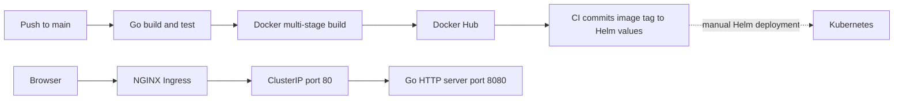

# Go web application — Docker, CI and Kubernetes

A small Go HTTP application used to practice packaging and delivering software.
The application serves four static pages; the engineering focus is the path from
a Git commit to a versioned container image and Kubernetes deployment manifests.

## Architecture



Implemented components:

- Go standard-library HTTP server; `/` redirects to `/home`.
- Multi-stage Dockerfile with a Go builder and a distroless runtime.
- GitHub Actions builds and tests the application, publishes an image, and commits
  its tag to `helm/go-web-app/values.yaml`.
- Helm chart and equivalent raw Deployment, Service and Ingress manifests.

There is no Argo CD Application, vulnerability-scanning step, or observability
stack in this repository. The Helm directory can be consumed by a separately
configured GitOps controller, but automated cluster reconciliation is not
demonstrated here.

## Run locally

Use Go 1.22.5 or later. From the repository root:

```bash
go test ./...
go run .
```

Open [localhost:8080/home](http://localhost:8080/home). Other routes are
`/courses`, `/about` and `/contact`. Keep the working directory at the repository
root so the server can find `static/`.

## Container

With a running Docker engine:

```bash
docker build -t go-web-app:local .
docker run --rm -p 127.0.0.1:8080:8080 go-web-app:local
```

The build context excludes Git data, local binaries and environment files.

## Kubernetes with Helm

Requires Helm, a Kubernetes cluster and an accessible container image.
First inspect the rendered resources:

```bash
helm lint helm/go-web-app
helm template go-web-app helm/go-web-app
```

Deploy an image tag that exists in your registry:

```bash
helm upgrade --install go-web-app helm/go-web-app --set image.repository=karray005/go-web-app --set-string image.tag=YOUR_PUBLISHED_TAG
kubectl rollout status deployment/go-web-app
kubectl port-forward service/go-web-app 8080:80
```

Port forwarding makes the application available without an ingress controller.
For the supplied Ingress, install/configure an NGINX ingress controller and map
`go-web-app.local` to its reachable address. Paths are forwarded unchanged.

The chart supports `replicaCount` and `image.repository/tag/pullPolicy`. Resource
names, service ports and the ingress host are fixed, so use one release per
namespace. The checked-in tag is an example from CI history; its availability
in Docker Hub has not been verified.

`k8s/manifests/` is an alternative deployment using the unversioned image name.
Use either raw manifests or Helm in a namespace, not both. Prefer a specific
image tag or digest for repeatable deployments.

## CI behavior and setup

[The workflow](.github/workflows/ci.yaml) runs for pushes to `main`, excluding
Markdown-only and Helm-only changes:

1. Build the Go binary and run tests.
2. Build and push `karray005/go-web-app:<run-number>-<commit>` and `latest`.
3. Update the Helm image tag and push a bot commit.

A maintainer must configure `DOCKERHUB_TOKEN` as a GitHub Actions secret and allow
the workflow to write repository contents. A fork also needs its own registry
namespace. No registry credential belongs in Git.

A separate [pull-request validation workflow](.github/workflows/validate.yml)
runs Go tests, checks Helm image overrides and preserved ingress paths, then
builds the Docker image and smoke-tests its HTTP routes. It has read-only
repository permissions and does not publish images or deploy a cluster.
There is no image scan or cluster rollout verification step.

## Source layout

| Path | Purpose |
| --- | --- |
| `main.go`, `main_test.go` | HTTP routes and homepage test |
| `static/` | HTML pages and existing project image |
| `Dockerfile` | Application image |
| `helm/go-web-app/` | Parameterized image and replica count |
| `k8s/manifests/` | Raw Kubernetes alternative |
| `.github/workflows/ci.yaml` | Build, test, publish and tag update |

## Verification and limits

On 29 September 2026, `go test ./...`, a native build and HTTP route smoke checks
passed. Helm lint and rendering were checked, including an overridden image tag.
Container build and cluster rollout were not run because the local Docker engine
was unavailable.

This is a deployment learning project. It has one application test and no
database, authentication, TLS setup, resource limits, health probes or
load-testing evidence. The toolchain and base-image versions should be reviewed
before exposing a deployment publicly.

## Attribution

The application/module originates from
[iam-veeramalla/go-web-app](https://github.com/iam-veeramalla/go-web-app).
This repository's commit history records Ahmed Karray's Docker/Kubernetes/Helm
setup, CI workflow and root-route redirect. The original module path is retained.
See [LICENSE](LICENSE).
